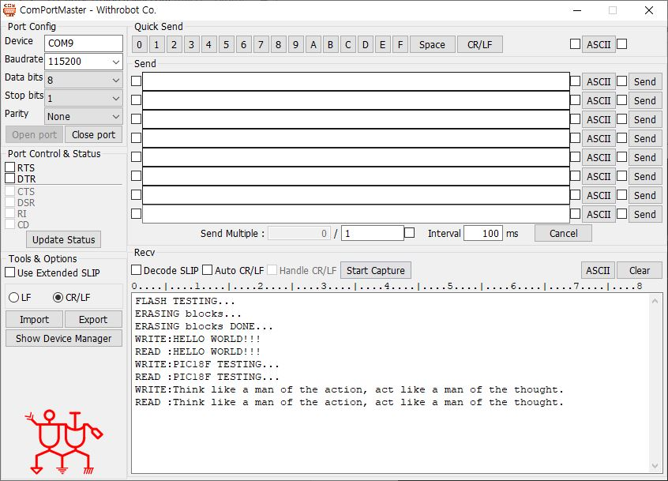

# PIC18F_AD45DB041X
AD45DB041x Library for PIC18F45K20 <br>

Refereces
1. https://www.adestotech.com/wp-content/uploads/doc8783.pdf
2. https://github.com/ibexuk/C_Flash_Memory_Atmel_AT45DB041
3. https://github.com/SodaqMoja/Sodaq_dataflash

Functions
```
void set_page_size(void);
uint8_t flash_read_status(void);
void flash_wait_ready(void);
uint8_t flash_check_present(void);
void flash_erase_page(uint16_t page_id);
void flash_erase_block(uint8_t block_id);
void flash_erase_all(void);
void flash_read_page(uint16_t page_id, uint8_t *buffer, size_t len);
void flash_write_page(uint16_t page_id, uint8_t *buffer, size_t len, uint8_t erase_first);
```

<br>
